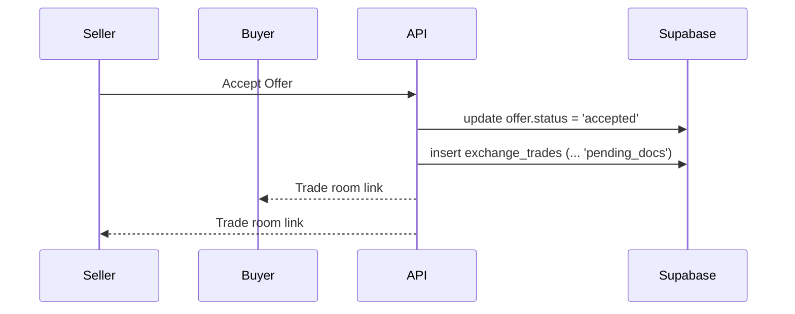

# Kontra UI Monorepo

This repository contains the **frontend** and **backend** for the Kontra demo application.

- `ui/` – React + Vite web interface
- `api/` – Express API with Supabase integration
- ios/` – SwiftUI mobile app that consumes the same API
## Getting Started

1. Install dependencies for each package:
   ```bash
   cd api && npm install
   cd ../ui && npm install
   ```

2. Configure environment variables:
   ```bash
   # API keys and port
   cp api/.env.example api/.env
   # URL of the running API for the frontend
   cp ui/.env.example ui/.env
   ```

   Edit `api/.env` with your Supabase, OpenAI, Twilio and Dialogflow credentials.
      Choose a shared development access token and set it as `DEV_ACCESS_TOKEN` in `api/.env` and `VITE_DEV_ACCESS_TOKEN` in `ui/.env` before starting either server. Optionally set `DEV_ORG_ID` or `DEV_USER_ID` to mimic a specific organization or user in local flows.
   Add your Sentry DSN as `VITE_SENTRY_DSN` in `ui/.env`.
     Optional `FEATURE_FLAGS` and `VITE_FEATURE_FLAGS` entries enable or disable
    upcoming modules. For example `sso` and `compliance` toggle the placeholder
    single sign-on and compliance scan routes. Enable `kyc` or `credit` to use
    real identity and credit-score providers instead of mocks.
    Set `VITE_FEATURE_FLAGS=trading` to expose the Trades dashboard.
    Set `PII_ENCRYPTION_KEY` to encrypt sensitive identifiers like SSNs.
    If `kyc` or `credit` are enabled, also provide the corresponding
    `KYC_API_URL`/`KYC_API_KEY` and `CREDIT_API_URL`/`CREDIT_API_KEY` values.
    Ensure the API is running on the same URL specified in `ui/.env`.
    Provide `REDIS_URL` to enable caching for hot queries.

4. Start the development servers in separate terminals:
   ```bash
   # API (defaults to PORT from `.env` or 5050)
   cd api && npm run dev

   # UI (Vite defaults to port 5173)
   cd ui && npm run dev
   ```

   The signup form sends Supabase magic links back to `window.location.origin`. 
   Ensure the UI is running on the same host/port that served the form (typically `http://localhost:5173`).

5. Run tests:
   ```bash
  npm test
   ```

This runs the UI unit tests with Jest and React Testing Library. Ensure dependencies have been installed in `ui/`.

## End-to-End Workflow

The application now flows through a streamlined sequence:

1. **Application** – submit loan data via `/api/applications`.
2. **Underwriting** – review tasks and generate decisions using the OCR/LLM endpoints.
3. **Escrow Setup** – create escrow records for approved loans.
4. **Servicing** – manage payments and portals.
5. **Risk Monitoring** – run risk scripts with `/api/risk/run` to update scores.
6. **Investor Reporting** – generate reports via `/api/reports` and `/api/investor-reports`.
7. **Collections** – track delinquent amounts in the collections table.
   
## Loan Application API

The API exposes basic endpoints for submitting and reviewing loan applications.

* `POST /api/applications` – submit a new application (supports `multipart/form-data` with a `document` upload)
* `GET /api/applications` – list submitted applications (use `?limit=N` to cap results)

These routes perform mock KYC and credit checks before storing the application in Supabase.

### Intelligent Underwriting

Additional endpoints provide simple stubs for OCR parsing, credit scoring and fraud detection:

* `POST /api/parse-document` – upload a financial document and receive extracted fields.
* `POST /api/document-summary` – return a short LLM summary of the uploaded file.
* `POST /api/auto-fill` – extract borrower details from IDs or W‑9s.
* `POST /api/classify-document` – quickly detect the type of uploaded files.
* `POST /api/credit-score` – calculate a risk score from bureau data and history with an explanation of adjustments.
* `POST /api/detect-fraud` – run lightweight anomaly detection on applicant data.

### LLM-Powered Workflows

New AI endpoints streamline doc ingestion and decision support:

* `POST /api/workflows/ingest` – upload an inspection, W‑9 or contract and receive an OCR + LLM summary. Inspection results are stored in `asset_inspections` when an `asset_id` is supplied.
* `GET /api/smart-recommendations` – suggests which loans to approve first and highlights refinance opportunities.
  
### LLM-Powered Workflows

New AI endpoints streamline doc ingestion and decision support:

* `POST /api/workflows/ingest` – upload an inspection, W‑9 or contract and receive an OCR + LLM summary. Inspection results are stored in `asset_inspections` when an `asset_id` is supplied.
* `GET /api/smart-recommendations` – suggests which loans to approve first and highlights refinance opportunities.

## Trading API

Trading endpoints let organizations submit and settle simple equity trades. Set the `trading` feature flag to enable these routes:

```bash
FEATURE_FLAGS=trading
```

If KYC/AML checks are desired, also enable the `kyc` flag and provide `KYC_API_URL` and `KYC_API_KEY` so counterparties can be screened.

The UI exposes a Trades dashboard when `VITE_FEATURE_FLAGS` includes `trading`, showing blotter, settlement status and webhook delivery. Trades can be tied to downstream tokenization flows when pool tokens are used as the settlement asset.

Supported `trade_type` values:

- `loan_sale` – secondary loan sale settled at par × price_pct ± accrued interest.
- `participation` – servicing remains with seller; pro‑rata distribution schedule stored in `event_payload`.
- `syndication_assignment` – sale with agent bank consent documentation.
- `portfolio_sale` – one trade with multiple assets tracked in `exchange_trade_assets`.
- `repo` / `reverse_repo` – include `repo_rate_bps`, `term_days`, and `collateral_ref`; unwinds automatically.
- `securitization_allocation` – CLO allocation referencing a `tranche_id` and `waterfall_config`.
- `debt_facility_draw` – draw linked to a `facility_line_id`.

### Offer Accept → Trade Creation



* `POST /api/trades` – submit a trade order.
  ```bash
  curl -X POST $API_URL/api/trades \
    -H "Content-Type: application/json" \
    -H "X-Org-Id: 1" \
       -d '{"trade_type":"repo","notional_amount":1000,"symbol":"AAPL","quantity":10,"price":150,"side":"buy","counterparties":["CP-1"]}'
  ```
  Response:
  ```json
   {"trade":{"id":1,"trade_type":"repo","notional_amount":1000,"symbol":"AAPL","quantity":10,"price":150,"side":"buy","counterparties":["CP-1"],"status":"pending","created_at":"2024-01-01T00:00:00.000Z"}}
  ```
* `GET /api/trades` – list trades with optional `status` or `trade_type` query parameters.
  ```bash
  curl "$API_URL/api/trades?trade_type=repo"
  ```
  Response:
  ```json
  {"trades":[{"id":1,"trade_type":"repo","notional_amount":1000,"symbol":"AAPL","quantity":10,"price":150,"side":"buy","counterparties":["CP-1"],"status":"pending","created_at":"2024-01-01T00:00:00.000Z"}]}
  ```
* `POST /api/trades/{id}/settle` – finalize a trade and mark it settled.
  ```bash
  curl -X POST $API_URL/api/trades/1/settle
  ```
  Response:
  ```json
  {"trade":{"id":1,"trade_type":"repo","notional_amount":1000,"symbol":"AAPL","quantity":10,"price":150,"side":"buy","counterparties":["CP-1"],"status":"settled","created_at":"2024-01-01T00:00:00.000Z","updated_at":"2024-01-02T00:00:00.000Z"}}
  ```
### Webhook events

Register webhooks via `/api/webhooks` to receive trading notifications:

* `trade.created` – sent after a trade order is accepted.
* `trade.settled` – sent when a trade is settled.

Each webhook delivers the event name and payload containing the trade and `organization_id`, for example:

```json
{"event":"trade.created","payload":{"trade":{...},"organization_id":1}}
```

## Tokenization rails

Express routes under `/api/tokenization` expose a demo ERC-20 pool factory and whitelist registry so trades and draw notes can be settled as on-chain tokens:

* `GET /api/tokenization/stack` returns the active network, admin wallet and deployed contract addresses for the pool factory and whitelist registry.
* `POST /api/tokenization/whitelist` upserts an investor entry (e.g., `{ "address": "0xabc", "investorType": "qualified" }`).
* `POST /api/tokenization/pools` mints a new pool token; follow with `POST /api/tokenization/pools/{poolId}/mint` or `/burn` to adjust supply.
* `GET /api/tokenization/pools` and `/api/tokenization/pools/{poolId}/address` list deployed pools and their contract addresses.
* Construction draws that reach an approved state can be tokenized via `/api/draw-requests/tokenizations` and `/api/draw-requests/{id}/tokenizations/mint` to issue notes against funded amounts.

Set `CHAIN_RPC_URL` (or `ALCHEMY_RPC_URL`) to point at a devnet RPC and `CHAIN_PRIVATE_KEY` to derive the admin wallet used in tokenization transactions. Including `tokenization` in `VITE_FEATURE_FLAGS` unlocks the Tokenization panel in the SaaS dashboard so operators can inspect the stack, whitelist status and minted pools.

## Escrow Administration

Phase 4 introduces an `escrows` table tracking tax and insurance reserves for each loan. A Supabase Edge Function (`api/edge-functions/fetchTaxBills.js`) can be scheduled monthly to update real-world tax amounts. The UI exposes an "Escrows" dashboard showing the latest amounts and account balance.
Additional servicing endpoints now provide a complete payment portal and escrow management workflow:

- `GET /api/escrows/upcoming` lists escrow balances with projected balances and next tax/insurance due dates.
- `POST /api/loans/:id/escrow/pay` records tax or insurance disbursements.
- `GET /api/loans/:id/escrow/projection` returns a 12‑month balance projection.
- Background script `api/workerReminders.js` emails and texts borrowers a few days before payments are due, batching reminder deliveries for better performance.

## Phase 5

Collections, investor reporting and asset management follow the same pattern:

1. **Data model** – tables are defined in `api/schema-phase5.sql` for `collections`, `investor_reports` and `assets`.
2. **API routes** – new CRUD endpoints are implemented in `api/index.js` under `/api/collections`, `/api/investor-reports` and `/api/assets`.
3. **UI pages** – React components in `ui/src/components` display and create records for these tables.
4. **User roles** – `api/schema-user-roles.sql` adds a `user_roles` table used to map Clerk users to roles.
5. **Workflows** – background jobs (`api/workerCollections.js` and `api/edge-functions/updateAssetValues.js`) illustrate how Render cron jobs or Supabase Scheduled Functions keep data in sync, with asset value updates now batched into a single request.
6. **Predictive Models** – nightly scripts (`npm run score-assets`, `npm run score-loans` and `npm run score-troubled`) update risk scores for assets, loans and troubled assets.
7. **On-chain dashboards** – `/api/blockchain/performance` streams loan-level DSCR, LTV, delinquency and paydown metrics from on-chain receipts into the On-Chain dashboard, alongside Supabase-backed transactions and cashflows.
8. **AI token pricing** – `api/services/tokenPricingAi.js` blends DSCR, LTV, market volatility and chain premiums to price ERC-20 participation tokens and exposes the valuations to the UI.
9. **RWA expansion** – the backlog now covers CRE bridge loans, equipment leases and revenue-based financing so additional collateral types can be added to the same blockchain + pricing rails.
## Customer Care AI & Voice Bot

The `/api/ask` endpoint now exposes helper functions `get_escrow_balance` , `get_payoff_instructions`, `get_troubled_assets` and `get_revived_assets` so the Virtual Assistant can answer loan servicing and asset management questions. A Twilio voice webhook (`/api/voice`) sends caller speech to Google Dialogflow and replies using text-to-speech, allowing borrowers to call in and ask for balances or payoff details.


## Automated Customer Communications

Endpoint `/api/send-communication` generates reminder messages with OpenAI and delivers them via email, SMS and an in-app notification. SMTP and Twilio credentials must be configured in `.env` for live delivery.

## Enhanced Portfolio Insight

- `POST /api/portfolio-summary` returns a PDF narrative overview of loan performance for a given period.
- `POST /api/query-loans` interprets natural language filters and returns matching loans.
  The Analytics dashboard now features a BI widget where you can type queries like

## Advanced Analytics & Reporting

- `POST /api/reports/run` executes custom queries and can return a PDF.
- `POST /api/reports/schedule` schedules recurring PDF emails.
- `POST /api/reports/save` stores a named report definition.
- `GET /api/reports/saved` lists saved reports.
- `GET /api/reports/fields` retrieves available columns for a table.
- `GET /api/reports/export` exports table data as CSV or JSON.
  
  
## Construction & Lending Features

- `POST /api/validate-invoice` validates invoices against project budgets.
- `POST /api/project-forecast` predicts schedule delays or cost overruns.
- `POST /api/audit-lien-waiver` checks lien waiver text for compliance.
- `POST /api/assets/:assetId/collateral` and `GET /api/assets/:assetId/collateral` link permits, lien positions and asset QR records.
- `POST /api/assets/:id/upload` ingests mortgage docs or property photos and stores AI inspection results.
- `POST /api/assets/:id/revive` suggests an asking price and marketing blurb for revived assets.
- `POST /api/financing-scorecard` returns a Finance Readiness rating.
  
"Show me all loans originated in Q1 2025 with >5% interest over $200k" and instantly see the results.

## Compliance & Audit Automation

- `POST /api/regulatory-scan` analyzes document text against a ruleset and returns any compliance issues.
- `GET /api/evidence-dossier/:loanId` assembles communications and uploaded files for audit review.
- `POST /api/pci-scan` runs a simple PCI compliance check.
- `GET /api/gdpr-export/:userId` exports a user's stored data.
- `DELETE /api/gdpr-delete/:userId` removes the user's data on request.
- `POST /api/generate-closing-doc` returns a simple closing statement PDF.
- Field-level changes are recorded to an encrypted `api/auditLogs.enc` file whenever data is created or modified. Set `ENCRYPTION_KEY` in `api/.env` to secure the log.
- These controls provide a foundation for SOC‑2 readiness alongside existing Sentry monitoring.
- `POST /api/generate-tax-form` produces 1098 or 1099 forms.
- Sensitive personal identifiers like SSNs are encrypted at rest using `PII_ENCRYPTION_KEY`.
- `/api/otp` endpoints provide a basic SMS or email verification step for two-factor authentication.
- Role-based access control middleware checks member roles from the `organization_members` table.
-Compliance-related routes are disabled unless the `compliance` feature flag is
set.

- ## Continuous Learning & Feedback

- `POST /api/feedback` records operator feedback on decisions like loan approvals or draw reviews. Logged examples can be used to fine-tune prompts or models over time.

## Hospitality Features

The API also includes basic hospitality modules:

- `POST /api/guests` and `GET /api/guests` manage guest profiles.
- `POST /api/rate-recommendation` suggests optimal room pricing.
- `POST /api/service-request` logs housekeeping or other guest requests.
- `POST /api/forecast-inventory` predicts upcoming supply needs.
- `POST /api/demand-forecast` returns a simple occupancy forecast for the next week.
- `POST /api/suggest-upsells` returns personalized offers for a guest.

## Phase 6 – Analytics & Insights

Restaurant dashboards now surface operational metrics:

- `GET /api/analytics/restaurant` returns table turnover, average payment time and tip performance.
- `GET /api/accounting/entries` exports payment entries as JSON or CSV.
The staff dashboard visualizes these metrics and provides a one-click accounting export.
- `POST /api/forecast-metrics` forecasts the next metric value from a history array.
- `POST /api/detect-anomalies` identifies outliers in an array of numbers.
- `POST /api/predict-churn` estimates if a customer is likely to cancel based on usage.
- `POST /api/suggest-plan` advises when to upgrade a subscription plan.

## Integrations & Marketplace

- OpenAPI specification is served at `/openapi.json` with Swagger UI at `/api-docs`.
- ## Visual Workflow Builder

A drag-and-drop designer lets you automate tasks without code. Create triggers and actions, then save sequences as reusable workflows. The builder uses the new `/api/workflows` endpoints to store your automations. Workflows can now be executed via `/api/workflows/:id/run`, enabling cross-application steps like external HTTP requests, AI document reviews and Supabase data transfers.
- `POST /api/webhooks` registers a URL to receive `loan.created`, `payment.created` and `booking.created` events. Registered hooks are stored in the `webhooks` table so they persist across restarts.
- `GET /api/integrations` lists connected apps. Connect QuickBooks, Xero, Toast, Square or Procore via `POST /api/integrations/{name}/connect`. Connection status is stored in the `integration_statuses` table.
- Hospitality modules now include `/api/bookings` endpoints for room reservations.

## Accessibility & Performance

The UI now registers as a Progressive Web App and caches assets for offline use.
User actions like draw requests are queued in the browser when offline and
automatically synced once connectivity is restored.
Navigation and search inputs include screen reader labels and focus outlines for
better keyboard access. Heavy chart pages are code-split using `React.lazy`
to improve initial load time. A "Suggest a Feature" form lets users send tagged
feedback directly from the sidebar.

## Design System

Common tokens for colors, spacing and typography are defined in `ui/src/theme.js`
and consumed by Tailwind via `tailwind.config.js`. Reusable UI primitives are
exported from `ui/src/components/ui` including `Button`, `Card`, `Table` and
`FormField` components.

## Locale & Config

All UI strings are externalized under `ui/src/locales`. Wrap the app in
`LocaleProvider` to switch languages. Feature flags can be set via the
`FEATURE_FLAGS` and `VITE_FEATURE_FLAGS` environment variables to enable
modules like `hospitality` or `assets`.

## Multi-Tenancy & SSO

Organizations are stored in a new `organizations` table with optional
`branding` JSON. Users join an organization via `organization_members` and
admins can update logos or primary colors from the Settings page.
Placeholder SAML/OAuth endpoints live under `/api/sso` illustrating where
single sign-on would integrate. These routes are disabled unless the `sso`
feature flag is enabled.

Include the organization id in API requests using an `X-Org-Id` header (or via
authenticated user metadata) so each tenant only accesses its own data.

Invitations allow admins to onboard members by email. `POST /api/invites`
creates a token linked to an organization. Visiting the UI with
`?invite=TOKEN` presents a sign-up form that accepts the invite and sets the
user's `organization_id` metadata, creating a member record.

## Subscription Plans

Choose from three plans to match your organization's needs:

| Plan | Price | Key Features |
| --- | --- | --- |
| **Basic** | Free | Up to 3 users, community support |
| **Pro** | $50/mo | Up to 10 users, priority support |
| **Enterprise** | $200/mo | Unlimited users, dedicated support |

Change plans via `/api/subscription` by posting `{ plan: 'pro' }` with your
`X-Org-Id` header. Available plans can be listed from `/api/plans`.

## High-Performance Architecture

Read queries can target a Supabase read replica when `SUPABASE_REPLICA_URL` is
set. Hot query results are cached via Redis when `REDIS_URL` is configured.
Expensive scoring tasks can be queued by posting to `/api/jobs/score-*` and are
processed asynchronously by a lightweight worker.
The dashboard overview and integration marketplace endpoints now read from the
replica and populate Redis-backed caches for high-traffic requests.

## Deployment

### Vercel
Place `vercel.json` inside the **ui/** directory so Vercel deploys from that folder. The file defines the `buildCommand`, `outputDirectory` and any environment variables (`VITE_API_URL`, `VITE_SUPABASE_URL`, `VITE_SUPABASE_ANON_KEY`, `VITE_SENTRY_DSN`). After pushing changes, Vercel will provide a preview link such as `https://kontra-ui.vercel.app`.
In your Vercel project settings, set the **Root Directory** to `ui/` so deployments build from the frontend.

### Render
The API is configured as a web service in `render.yaml`. It exposes `/health` for health checks and reports errors to Sentry when `SENTRY_DSN` is set.

## Backend Schema Migrations (Supabase + Render)

The API expects baseline Supabase tables/columns for multi-tenant routes (`/api/portfolio`, `/api/servicing`, `/api/governance`, `/api/markets`, `/api/reports`).

1. Apply migrations before starting the API:
   ```bash
   cd api
   supabase db push
   ```
   (or `supabase migration up` if that matches your workflow)

2. Validate schema after migrating:
   ```bash
   cd api
   npm run test:schema
   ```

3. Render deployment order:
   - Run Supabase migrations against production first (`supabase db push --linked` from `api/`).
   - Deploy/restart the Render API service only after migration completes.

In non-production mode, the API now logs a startup schema health warning if required baseline tables/columns are missing.
